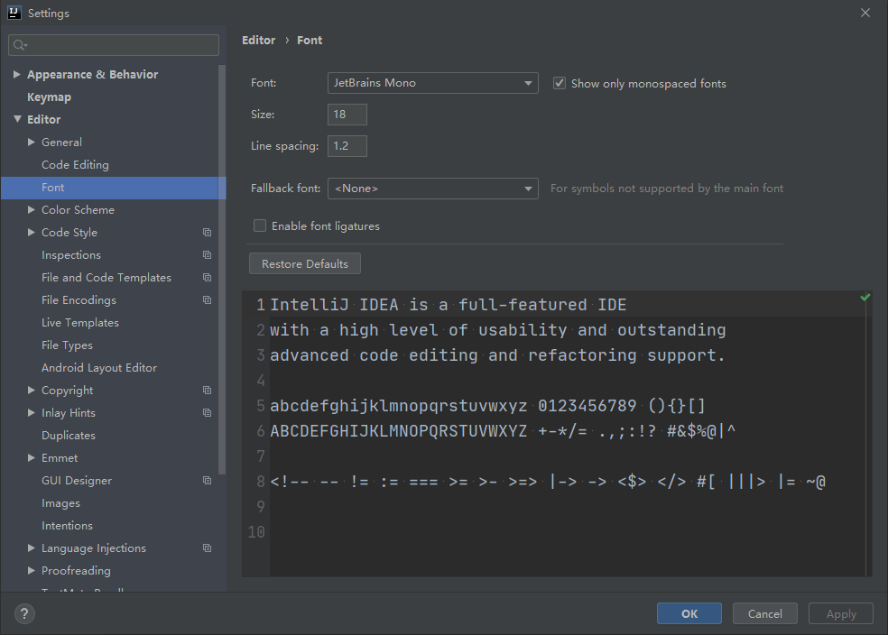
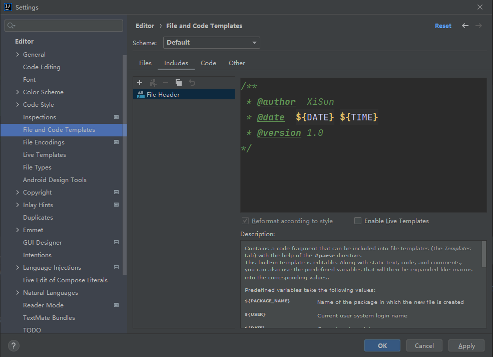
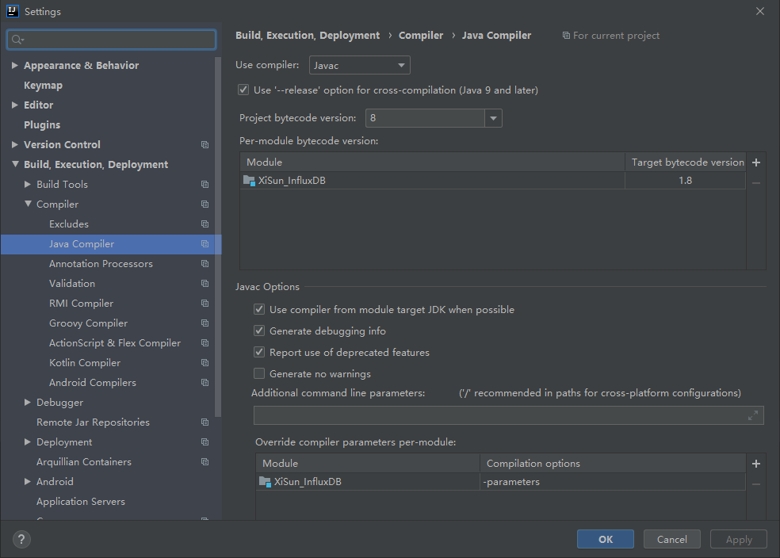
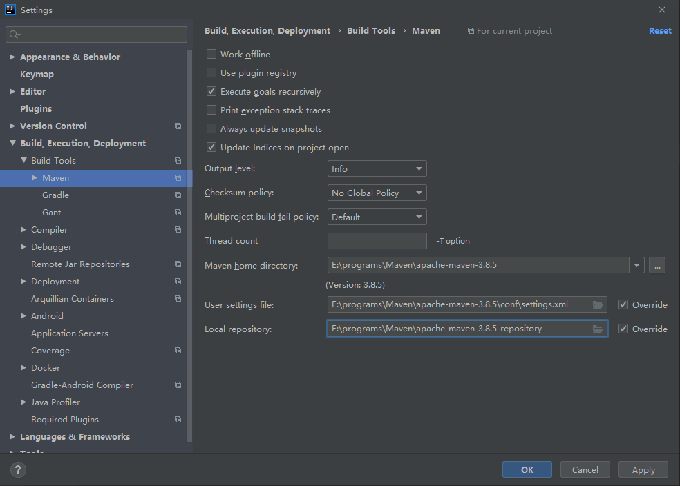
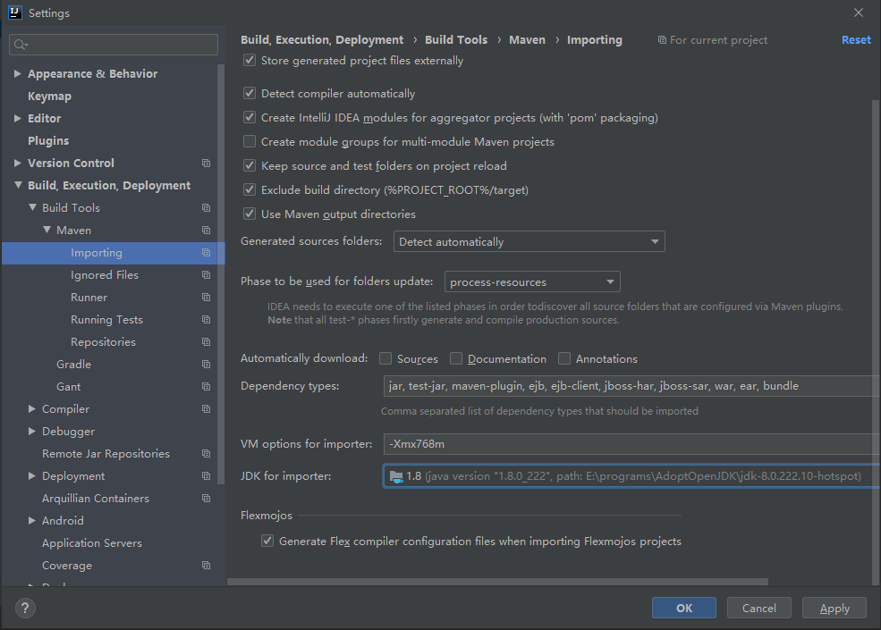
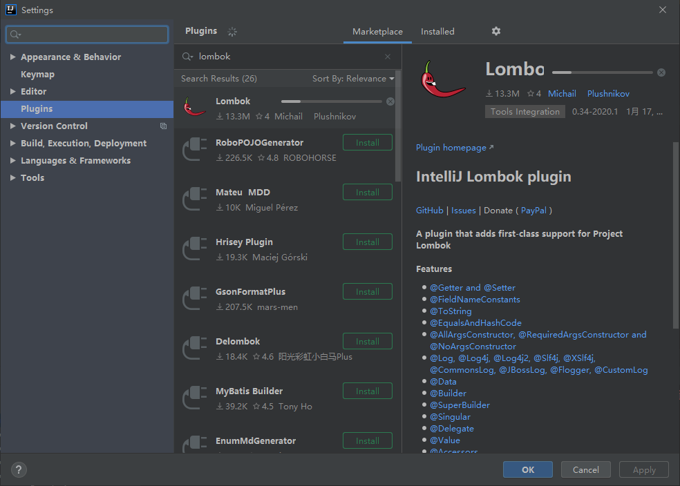

## 基本设置

### 字体设置

### 注释信息

### Java Compiler

### Maven 设置

### Lombok 插件

## 常规语法

`Ctrl + H`：查看类的继承层级关系

`Ctrl + Alt + B`：查找接口的实现类

`Ctrl + Alt + S`：打开 settings

`Ctrl + Alt + T`：对一段代码添加包围语句，如 try/catch

`Ctrl + Y`：删除当前行

`Ctrl + D`：复制当前行

`Shift + F6`：重命名

`Ctrl + F`：查找

`Ctrl + R`：替换
