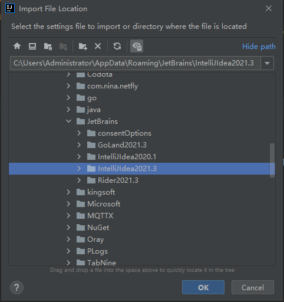

*date: 2021-04-13*

## 基本设置

### 字体设置


### 编码设置


### 注释信息


### 导出配置





> 导出配置后，原先设置的配置会失效，建议不要使用此操作。

### Java Compiler


### Maven


### Structure


### 全局设置

说明，通过以下标记，可以判断配置的是全局，还是只针对当前项目：


Java Compiler：


Maven：


Structure：


## 插件管理

参考：https://wcqblog.com/article/detail/262534926061142016

### Lombok


### Grep Console


- 可以配置日志输出，调试。

### Maven Helper


- 帮助优化 Maven 依赖，以及排除不必要的依赖。

### Alibaba Java Coding Guidelines


- 阿里 Java 开发规范。

### Rainbow Brackets


- 此插件会将括号变成彩色，同一组括号颜色一样，相邻两个括号颜色不一样。

### Tabnine


- 此插件提供代码补全功能。

## 快捷方式

`Ctrl + H`：查看类的继承层级关系

`Ctrl + Alt + U`：查看类图

`Ctrl + Alt + B`：查找接口的实现类

`Ctrl + Alt + ⬅`：回到上一步

`Ctrl + Alt + →`：回到下一步

`Ctrl + Alt + S`：打开 settings

`Ctrl + Alt + T`：对一段代码添加包围语句，如 try/catch

`Ctrl + Y`：删除当前行

`Ctrl + D`：复制当前行

`Shift + F6`：重命名

`Ctrl + F`：查找

`Ctrl + R`：替换

## 引入本地 Jar 包

通过添加 Libraries 的方式引入：

1. 首先在根目录下创建一个 libs 的目录：

   

2. 打开 File -> Project Structure。

3. 单击 Libraries ---> "+" ---> "Java" ---> 选择我们导入的项目主目录，点击OK：

   

   

4. 注意：在弹出的方框中点击 Cancel，取消将其添加到 Module 中。

   

5. libs 目录创建成功，删除目录中添加进来的多余内容，重新添加需要的 jar 包：

   

6. 重新添加需要的 jar 包：

   

7. 引入 jar 包：Modules -> 项目 -> "Dependencies"，点击 "+" ---> "Library"，将刚才创建成功的 Library 目录加入：

   

   

8. jar 包导入成功！

9. 如果要将引入的 jar 包打包到 war 中，参考在 pom 文件中添加以下配置：

   ```xml
   <!-- 引用本地jar包 -->
   <dependency>
       <groupId>com.aspose</groupId>
       <artifactId>aspose-words</artifactId>
       <version>16.8.0</version>
       <scope>system</scope>
       <systemPath>${pom.basedir}/libs/aspose-words-16.8.0-jdk16.jar</systemPath>
   </dependency>
   <dependency>
       <groupId>com.aspose</groupId>
       <artifactId>aspose-cells</artifactId>
       <version>8.5.2</version>
       <scope>system</scope>
       <systemPath>${pom.basedir}/libs/aspose-cells-8.5.2.jar</systemPath>
   </dependency>
   <dependency>
       <groupId>com.aspose</groupId>
       <artifactId>aspose-slides</artifactId>
       <version>15.9.0</version>
       <scope>system</scope>
       <systemPath>${pom.basedir}/libs/aspose.slides-15.9.0.jar</systemPath>
   </dependency>
   ```

   ```xml
   <!-- 将本地jar包打到war中 -->
   <plugin>
       <groupId>org.apache.maven.plugins</groupId>
       <artifactId>maven-dependency-plugin</artifactId>
       <executions>
           <execution>
               <id>copy-dependencies</id>
               <phase>compile</phase>
               <goals>
                   <goal>copy-dependencies</goal>
               </goals>
               <configuration>
                   <outputDirectory>${project.build.directory}/${project.build.finalName}/WEB-INF/lib</outputDirectory>
                   <includeScope>system</includeScope>
               </configuration>
           </execution>
       </executions>
   </plugin>
   ```

## 本文参考

https://www.cnblogs.com/hunttown/p/13488486.html

## 声明

写作本文初衷是个人学习记录，鉴于本人学识有限，如有侵权或不当之处，请联系 [wdshfut@163.com](mailto:wdshfut@163.com)。
