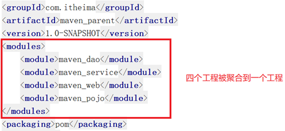
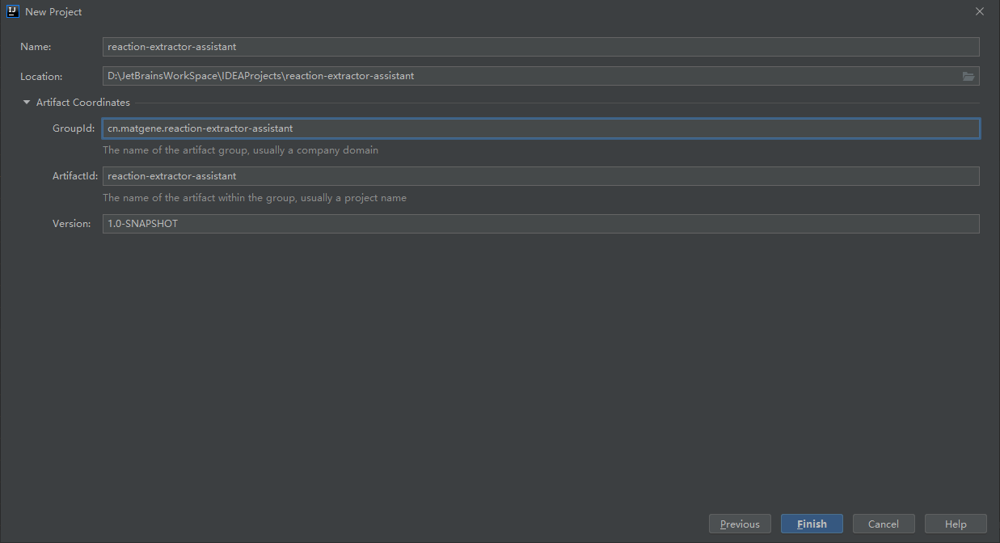

## 分模块构建 maven 工程分析

在现实生活中，汽车厂家进行汽车生产时，由于整个生产过程非常复杂和繁琐，工作量非常大，所以车场都会将整个汽车的部件分开生产，最终再将生产好的部件进行组装，形成一台完整的汽车：


类似的，随着项目功能的增加，项目本身会变得越来越庞大，这个时候，代码的良好管理和规划就会变得很重要。为了提高效率，根据业务的不同将揉作一团的业务代码分离出来，业务划分上分割清晰，提高代码复用率，例如：


上述功能的实现就是代码这一层级的变动，可以采用多项目模式和多模块模式：

- 多项目：每个业务单独新建项目并编写相应逻辑
- 多模块：业务聚合在一个项目中的不同模块中，然后通过依赖调用实现业务逻辑

### maven 工程的继承

在 java 语言中，类之间是可以继承的，通过继承，子类就可以引用父类中非 private 的属性和方法。同样，在 maven 工程之间也可以继承，子工程继承父工程后，就可以使用在父工程中引入的依赖。继承的目的是为了消除重复代码。


### maven 工程的聚合

在 maven 工程的 pom.xml 文件中，可以使用 <modules> 标签将其他 maven 工程聚合到一起，聚合的目的是为了进行统一操作。

例如，拆分后的 maven 工程有多个，如果要进行打包，就需要针对每个工程分别执行打包命令，操作起来非常繁琐。这时就可以使用 <modules> 标签将这些工程统一聚合到 maven 工程中，需要打包的时候，只需要在此工程中执行一次打包命令，其下被聚合的工程就都会被打包了。



## 分模块构建 maven 工程

### 构建父模块

新建 maven 项目：



保留 pom.xml 文件，删除 src 目录：


### 构建子模块

新建 module 1：


新建 module 2：


如果需要更多的模块，重复上述步骤。

### 父模块 pom 配置

公用的 pom 配置，可以放在父模块的 pom.xml 文件中：

```xml
<?xml version="1.0" encoding="UTF-8"?>
<project xmlns="http://maven.apache.org/POM/4.0.0"
         xmlns:xsi="http://www.w3.org/2001/XMLSchema-instance"
         xsi:schemaLocation="http://maven.apache.org/POM/4.0.0 http://maven.apache.org/xsd/maven-4.0.0.xsd">
    <modelVersion>4.0.0</modelVersion>

    <groupId>cn.matgene.reaction-extractor-assistant</groupId>
    <artifactId>reaction-extractor-assistant</artifactId>
    <!-- parent必须使用pom格式打包并上传到仓库 -->
    <packaging>pom</packaging>
    <version>1.0-SNAPSHOT</version>
    <modules>
        <module>patent-loader</module>
        <module>consumer-log</module>
        <module>consumer-reaction</module>
        <module>consumer-timeout</module>
    </modules>

    <!-- 全局版本管理 -->
    <properties>
        <project.build.sourceEncoding>UTF-8</project.build.sourceEncoding>
        <java.version>1.8</java.version>
        <maven.compiler.version>3.8.1</maven.compiler.version>
        <maven.compiler.source>${java.version}</maven.compiler.source>
        <maven.compiler.target>${java.version}</maven.compiler.target>
    </properties>

    <!-- 全局依赖管理 -->
    <dependencies>
        <dependency>
            <groupId>org.projectlombok</groupId>
            <artifactId>lombok</artifactId>
            <version>1.18.12</version>
        </dependency>
        <dependency>
            <groupId>ch.qos.logback</groupId>
            <artifactId>logback-classic</artifactId>
            <version>1.2.3</version>
        </dependency>
        <dependency>
            <groupId>com.github.danielwegener</groupId>
            <artifactId>logback-kafka-appender</artifactId>
            <version>0.2.0-RC1</version>
        </dependency>
        <dependency>
            <groupId>commons-io</groupId>
            <artifactId>commons-io</artifactId>
            <version>2.7</version>
        </dependency>
        <dependency>
            <groupId>net.sf.json-lib</groupId>
            <artifactId>json-lib</artifactId>
            <version>2.4</version>
            <classifier>jdk15</classifier>
        </dependency>
        <dependency>
            <groupId>org.apache.kafka</groupId>
            <artifactId>kafka-clients</artifactId>
            <version>2.3.1</version>
        </dependency>
        <dependency>
            <groupId>org.junit.jupiter</groupId>
            <artifactId>junit-jupiter</artifactId>
            <version>5.6.2</version>
            <scope>test</scope>
        </dependency>
    </dependencies>

    <build>
        <plugins>
            <plugin>
                <groupId>org.apache.maven.plugins</groupId>
                <artifactId>maven-compiler-plugin</artifactId>
                <version>${maven.compiler.version}</version>
                <configuration>
                    <source>${maven.compiler.source}</source>
                    <target>${maven.compiler.target}</target>
                </configuration>
            </plugin>
        </plugins>
    </build>
</project>
```

### 子模块 pom 配置

子模块单独使用的 pom 配置，放在子模块自己的 pom.xml 文件中：

```xml
<?xml version="1.0" encoding="UTF-8"?>
<project xmlns="http://maven.apache.org/POM/4.0.0"
         xmlns:xsi="http://www.w3.org/2001/XMLSchema-instance"
         xsi:schemaLocation="http://maven.apache.org/POM/4.0.0 http://maven.apache.org/xsd/maven-4.0.0.xsd">
    <parent>
        <artifactId>reaction-extractor-assistant</artifactId>
        <groupId>cn.matgene.reaction-extractor-assistant</groupId>
        <version>1.0-SNAPSHOT</version>
    </parent>
    <modelVersion>4.0.0</modelVersion>

    <artifactId>patent-loader</artifactId>

    <properties>
        <app.main.class>cn.matgene.patent.cn.matgene.patent.loader.PatentLoaderJob</app.main.class>
    </properties>

    <build>
        <plugins>
            <plugin>
                <groupId>org.apache.maven.plugins</groupId>
                <artifactId>maven-shade-plugin</artifactId>
                <version>3.2.3</version>
                <configuration>
                    <createDependencyReducedPom>false</createDependencyReducedPom>
                </configuration>
                <executions>
                    <execution>
                        <phase>package</phase>
                        <goals>
                            <goal>shade</goal>
                        </goals>
                        <configuration>
                            <transformers>
                                <transformer
                                        implementation="org.apache.maven.plugins.shade.resource.ManifestResourceTransformer">
                                    <manifestEntries>
                                        <Main-Class>${app.main.class}</Main-Class>
                                        <X-Compile-Source-JDK>${maven.compiler.source}</X-Compile-Source-JDK>
                                        <X-Compile-Target-JDK>${maven.compiler.target}</X-Compile-Target-JDK>
                                    </manifestEntries>
                                </transformer>
                            </transformers>
                        </configuration>
                    </execution>
                </executions>
            </plugin>
        </plugins>
    </build>
</project>
```

上面构建的项目比较简单，各模块之间不存在依赖关系，同时，因为每个模块都需要打包，因此把打包的插件放在每一个子模块的 pom.xml 文件中。

### 一个 spring web 项目的实例

1. 父工程 maven_parent 构建

```xml
 <properties>
        <spring.version>5.0.5.RELEASE</spring.version>
        <springmvc.version>5.0.5.RELEASE</springmvc.version>
        <mybatis.version>3.4.5</mybatis.version>
</properties>

<!--锁定jar版本-->
<dependencyManagement>
    <dependencies>
        <!-- Mybatis -->
        <dependency>
            <groupId>org.mybatis</groupId>
            <artifactId>mybatis</artifactId>
            <version>${mybatis.version}</version>
        </dependency>
        <!-- springMVC -->
        <dependency>
            <groupId>org.springframework</groupId>
            <artifactId>spring-webmvc</artifactId>
            <version>${springmvc.version}</version>
        </dependency>
        <!-- spring -->
        <dependency>
            <groupId>org.springframework</groupId>
            <artifactId>spring-context</artifactId>
            <version>${spring.version}</version>
        </dependency>
        <dependency>
            <groupId>org.springframework</groupId>
            <artifactId>spring-core</artifactId>
            <version>${spring.version}</version>
        </dependency>
        <dependency>
            <groupId>org.springframework</groupId>
            <artifactId>spring-aop</artifactId>
            <version>${spring.version}</version>
        </dependency>
        <dependency>
            <groupId>org.springframework</groupId>
            <artifactId>spring-web</artifactId>
            <version>${spring.version}</version>
        </dependency>
        <dependency>
            <groupId>org.springframework</groupId>
            <artifactId>spring-expression</artifactId>
            <version>${spring.version}</version>
        </dependency>
        <dependency>
            <groupId>org.springframework</groupId>
            <artifactId>spring-beans</artifactId>
            <version>${spring.version}</version>
        </dependency>
        <dependency>
            <groupId>org.springframework</groupId>
            <artifactId>spring-aspects</artifactId>
            <version>${spring.version}</version>
        </dependency>
        <dependency>
            <groupId>org.springframework</groupId>
            <artifactId>spring-context-support</artifactId>
            <version>${spring.version}</version>
        </dependency>
        <dependency>
            <groupId>org.springframework</groupId>
            <artifactId>spring-test</artifactId>
            <version>${spring.version}</version>
        </dependency>
        <dependency>
            <groupId>org.springframework</groupId>
            <artifactId>spring-jdbc</artifactId>
            <version>${spring.version}</version>
        </dependency>
        <dependency>
            <groupId>org.springframework</groupId>
            <artifactId>spring-tx</artifactId>
            <version>${spring.version}</version>
        </dependency>
    </dependencies>
</dependencyManagement>

<build>
    <plugins>
        <plugin>
            <groupId>org.apache.maven.plugins</groupId>
            <artifactId>maven-compiler-plugin</artifactId>
            <version>3.1</version>
            <configuration>
                <source>1.8</source>
                <target>1.8</target>
                <encoding>UTF-8</encoding>
            </configuration>
        </plugin>
    </plugins>
</build>
```

2. 子工程 maven_pojo 构建

```xml
<dependencies>
    <dependency>
        <groupId>log4j</groupId>
        <artifactId>log4j</artifactId>
        <version>1.2.12</version>
    </dependency>
    <dependency>
        <groupId>c3p0</groupId>
        <artifactId>c3p0</artifactId>
        <version>0.9.1.2</version>
    </dependency>
</dependencies>
```

3. 子工程 maven_dao 构建

```xml
 <dependencies>
     <!-- maven_pojo的依赖 -->
     <dependency>
         <groupId>com.itheima</groupId>
         <artifactId>maven_pojo</artifactId>
         <version>1.0-SNAPSHOT</version>
     </dependency>
     <!-- Mybatis和mybatis与spring的整合 -->
     <dependency>
         <groupId>org.mybatis</groupId>
         <artifactId>mybatis</artifactId>
     </dependency>
     <dependency>
         <groupId>org.mybatis</groupId>
         <artifactId>mybatis-spring</artifactId>
         <version>1.3.1</version>
     </dependency>
     <!-- MySql驱动 -->
     <dependency>
         <groupId>mysql</groupId>
         <artifactId>mysql-connector-java</artifactId>
         <version>5.1.32</version>
     </dependency>
     <!-- druid数据库连接池 -->
     <dependency>
         <groupId>com.alibaba</groupId>
         <artifactId>druid</artifactId>
         <version>1.0.9</version>
     </dependency>
     <!-- spring相关 -->
     <dependency>
         <groupId>org.springframework</groupId>
         <artifactId>spring-context</artifactId>
     </dependency>
     <dependency>
         <groupId>org.springframework</groupId>
         <artifactId>spring-core</artifactId>
     </dependency>
     <dependency>
         <groupId>org.springframework</groupId>
         <artifactId>spring-aop</artifactId>
     </dependency>
     <dependency>
         <groupId>org.springframework</groupId>
         <artifactId>spring-expression</artifactId>
     </dependency>
     <dependency>
         <groupId>org.springframework</groupId>
         <artifactId>spring-beans</artifactId>
     </dependency>
     <dependency>
         <groupId>org.springframework</groupId>
         <artifactId>spring-aspects</artifactId>
     </dependency>
     <dependency>
         <groupId>org.springframework</groupId>
         <artifactId>spring-context-support</artifactId>
     </dependency>
     <dependency>
         <groupId>org.springframework</groupId>
         <artifactId>spring-test</artifactId>
     </dependency>
     <dependency>
         <groupId>org.springframework</groupId>
         <artifactId>spring-jdbc</artifactId>
     </dependency>
     <dependency>
         <groupId>org.springframework</groupId>
         <artifactId>spring-tx</artifactId>
     </dependency>
     <!-- junit测试 -->
     <dependency>
         <groupId>junit</groupId>
         <artifactId>junit</artifactId>
         <version>4.12</version>
     </dependency>
</dependencies>
```

4. 子工程 maven_service 构建

```xml
<dependencies>
    <!-- maven_dao的依赖 -->
    <dependency>
        <groupId>com.itheima</groupId>
        <artifactId>maven_dao</artifactId>
        <version>1.0-SNAPSHOT</version>
    </dependency>
</dependencies>
```

5. 子工程 maven_web 构建

```xml
<properties>
    <project.build.sourceEncoding>UTF-8</project.build.sourceEncoding>
    <maven.compiler.source>1.8</maven.compiler.source>
    <maven.compiler.target>1.8</maven.compiler.target>
</properties>

<dependencies>
    <!-- maven_service的依赖 -->
    <dependency>
        <groupId>com.itheima</groupId>
        <artifactId>maven_service</artifactId>
        <version>1.0-SNAPSHOT</version>
    </dependency>
    <dependency>
        <groupId>org.springframework</groupId>
        <artifactId>spring-webmvc</artifactId>
    </dependency>
</dependencies>

<build>
    <finalName>maven_web</finalName>
    <pluginManagement><!-- lock down plugins versions to avoid using Maven defaults (may be moved to parent pom) -->
        <plugins>
            <plugin>
                <artifactId>maven-clean-plugin</artifactId>
                <version>3.1.0</version>
            </plugin>
            <!-- see http://maven.apache.org/ref/current/maven-core/default-bindings.html#Plugin_bindings_for_war_packaging -->
            <plugin>
                <artifactId>maven-resources-plugin</artifactId>
                <version>3.0.2</version>
            </plugin>
            <plugin>
                <artifactId>maven-compiler-plugin</artifactId>
                <version>3.8.0</version>
            </plugin>
            <plugin>
                <artifactId>maven-surefire-plugin</artifactId>
                <version>2.22.1</version>
            </plugin>
            <plugin>
                <artifactId>maven-war-plugin</artifactId>
                <version>3.2.2</version>
            </plugin>
            <plugin>
                <artifactId>maven-install-plugin</artifactId>
                <version>2.5.2</version>
            </plugin>
            <plugin>
                <artifactId>maven-deploy-plugin</artifactId>
                <version>2.8.2</version>
            </plugin>
        </plugins>
    </pluginManagement>
</build>
```

6. 项目整体结构如下：

1) maven_parent 为父工程，其余工程为子工程，都继承父工程 maven_parent；

2) maven_parent 工程将其子工程都进行了聚合 ；

3) 子工程之间存在依赖关系，比如 maven_dao 依赖 maven_pojo，maven_service 依赖 maven_dao，maven_web 依赖 maven_service。

## 本文参考

https://juejin.cn/post/6844903970024980488

https://www.cnblogs.com/tianlong/p/10552848.html

声明：写作本文初衷是个人学习记录，鉴于本人学识有限，如有侵权或不当之处，请联系 [wdshfut@163.com](mailto:wdshfut@163.com)。