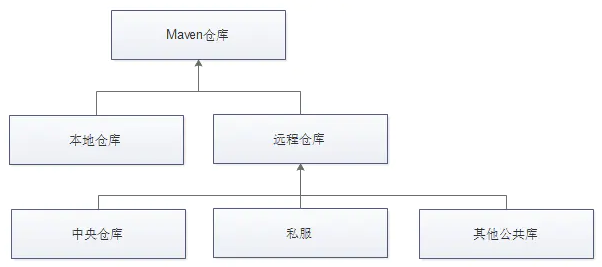

*date: 2021-01-19*

## 概述

Maven 仓库分为本地仓库和远程仓库，而远程仓库又分为 Maven 中央仓库、其他远程仓库和私服（私有服务器）。



Maven 项目使用的仓库一般有如下几种方式：

1. Maven 中央仓库，这是默认的仓库。
2. 镜像仓库，通过 sttings.xml 中的 settings.mirrors.mirror 配置。
3. 全局 profile 仓库，通过 settings.xml 中的 settings.repositories.repository 配置。
4. 项目仓库，通过 pom.xml 中的 project.repositories.repository 配置。
5. 项目 profile 仓库，通过 pom.xml 中的 project.profiles.profile.repositories.repository 配置。
6. 本地仓库。

如果所有仓库的配置都存在，那么依赖的搜索顺序也会变得异常复杂。

## 仓库的配置方式

### 本地仓库

Maven 默认的本地仓库地址为`${user.home}/.m2/repository`，也就是说，一个用户会对应的拥有一个本地仓库。

可以通过修改 ${user.home}/.m2/settings.xml，在`<settings>`节点下添加配置，更改默认的本地仓库地址：

```xml
<localRepository>D:\java\maven-repo</localRepository>
```

一般情况下，如果想让所有的用户使用统一的配置，那么可以修改 Maven 主目录下的 setting.xml：`${MAVEN_HOME}/conf/setting.xml`。

### Maven 中央仓库

在 Maven 安装目录的 lib 目录下，有一个 maven-model-builder-3.6.1.jar，里面的 org/apache/maven/model/pom-4.0.0.xml 文件定义了 Maven 默认中央仓库的地址：https://repo.maven.apache.org/maven2，如下图所示：

```xml
<repositories>
    <repository>
        <id>central</id>
        <name>Central Repository</name>
        <url>https://repo.maven.apache.org/maven2</url>
        <layout>default</layout>
        <snapshots>
            <enabled>false</enabled>
        </snapshots>
    </repository>
</repositories>

<pluginRepositories>
    <pluginRepository>
        <id>central</id>
        <name>Central Repository</name>
        <url>https://repo.maven.apache.org/maven2</url>
        <layout>default</layout>
        <snapshots>
            <enabled>false</enabled>
        </snapshots>
        <releases>
            <updatePolicy>never</updatePolicy>
        </releases>
    </pluginRepository>
</pluginRepositories>
```

一般使用阿里云镜像仓库代替默认的 Maven 中央仓库，配置方式有两种：

第一种，全局配置。修改 ${MAVEN_HOME}/conf/setting.xml 文件，在`<mirrors>`节点下添加配置：

```xml
<mirrors>
    <mirror>
        <id>alimaven</id>
        <name>aliyun maven</name>
        <url>http://maven.aliyun.com/nexus/content/groups/public/</url>
        <mirrorOf>central</mirrorOf>        
    </mirror>
<mirrors>
```

>修改全局配置后，所有使用此 Maven 的工程都会生效。
>
>< mirrorOf> 可以设置为哪个中央仓库做镜像，为名为 "central" 的中央仓库做镜像，写作 < mirrorOf>central< /mirrorOf>；为所有中央仓库做镜像，写作 < mirrorOf>*< /mirrorOf>（不建议）。Maven 默认中央仓库的 id 为 central。id是唯一的。

第二种，局部配置。在需要使用阿里云镜像仓库的 Maven 工程的 pom.xml 文件中添加：

```xml
<repositories>
    <repository>
        <id>aliyun</id>
        <url>http://maven.aliyun.com/nexus/content/groups/public</url>
        <releases>
            <enabled>true</enabled>
        </releases>
        <snapshots>
            <enabled>false</enabled>
        </snapshots>
    </repository>
</repositories>
<pluginRepositories>
    <pluginRepository>
        <id>aliyun-plugin</id>
        <url>http://maven.aliyun.com/nexus/content/groups/public</url>
        <releases>
            <enabled>true</enabled>
        </releases>
        <snapshots>
            <enabled>false</enabled>
        </snapshots>
    </pluginRepository>
</pluginRepositories>
```

>修改局部配置后，只对当前工程有效。

### 私服

第一种，全局配置。修改 ${MAVEN_HOME}/conf/setting.xml 文件，在`<profiles>`节点下添加配置：

```xml
<profiles>
    <profile>
      <id>matgene-nexus</id>
      <repositories>
        <repository>
          <id>nexus</id>
            <url>http://localhost:8081/nexus/content/groups/public/</url>
            <releases>
                <enabled>true</enabled>
            </releases>
            <snapshots>
                <enabled>false</enabled>
            </snapshots>
        </repository>
      </repositories>
      <pluginRepositories>
        <pluginRepository>
          <id>nexus-plugin</id>
          <url>http://localhost:8081/nexus/content/groups/public/</url>
            <releases>
                <enabled>true</enabled>
            </releases>
            <snapshots>
                <enabled>false</enabled>
            </snapshots>
        </pluginRepository>
      </pluginRepositories>
    </profile>
</profiles>
```

然后，在`<activeProfiles>`节点下添加激活配置（通过配置的 profile 的 id 标识进行激活）：

```xml
<activeProfiles>
    <activeProfile>matgene-nexus</activeProfile>
</activeProfiles>
```

第二种，局部配置。在需要使用私服的 Maven 工程的 pom.xml 文件中添加。

`上传`：

settings.xml：

```xml
<server>
    <id>releases</id>
    <username>admin</username>   
    <password>admin123</password>
</server>
<server>
    <id>snapshots</id>
    <username>admin</username>
    <password>admin123</password>
</server>
```

pom.xml：

```xml
<distributionManagement>
    <repository>
       <id>releases</id>
       <url>http://localhost:8081/nexus/content/repositories/releases/</url>
    </repository>
	<snapshotRepository>
   		<id>snapshots</id>
        <url>http://localhost:8081/nexus/content/repositories/snapshots/</url>
    </snapshotRepository>
</distributionManagement>
```

`下载`：

pom.xml：

```xml
<repositories>
    <repository>
        <id>nexus</id>
        <url>http://localhost:8081/nexus/content/groups/public/</url>
        <releases>
            <enabled>true</enabled>
        </releases>
        <snapshots>
            <enabled>false</enabled>
        </snapshots>
    </repository>
</repositories>
<pluginRepositories>
    <pluginRepository>
        <id>nexus-plugin</id>
        <url>http://localhost:8081/nexus/content/groups/public/</url>
        <releases>
            <enabled>true</enabled>
        </releases>
        <snapshots>
            <enabled>false</enabled>
        </snapshots>
    </pluginRepository>
</pluginRepositories>
```

> 在项目中，将私服地址更改为自己公司的实际地址。

## 依赖的下载顺序

### 准备测试环境

安装 JDK 和 Maven。

使用如下命令创建测试项目：

```powershell
yes | mvn archetype:generate -DarchetypeGroupId=org.apache.maven.archetypes -DarchetypeArtifactId=maven-archetype-webapp  -DinteractiveMode=true -DgroupId=com.pollyduan -DartifactId=myweb -Dversion=1.0 -Dpackage=com.pollyduan
```

创建完成后，为了避免后续测试干扰，先执行一次 compile。

```powershell
cd myweb
mvn compile
```

最后，修改 pom.xml 文件，将 junit 版本号改为 4.12 。我们要使用这个 jar 来测试依赖的搜索顺序。

### 默认情况

首先确保 junit 4.12 不存在：

```powershell
rm -rf ~/.m2/repository/junit/junit/4.12
```

默认情况下没有配置任何仓库，也就是说，既没更改 $MAVEN_HOME/conf/settings.xml，也没有添加 ~/.m2/settings.xml。

执行编译，查看日志中拉取 junit 的仓库。

```powershell
mvn compile

...
Downloaded from central: https://repo.maven.apache.org/maven2/junit/junit/4.12/junit-4.12.pom (24 kB at 11 kB/s)
```

从显示的仓库 id 可以看出：默认是从 Maven 中央仓库拉取的 jar。

### 配置镜像仓库 settings_mirror

创建 ~/.m2/setttings.xml，配置 Maven 中央仓库的镜像，如下：

```xml
<settings>
  <mirrors>
    <mirror>
      <id>settings_mirror</id>
      <url>https://maven.aliyun.com/repository/public</url>
      <mirrorOf>central</mirrorOf>
    </mirror>
  </mirrors>
</settings>
```

重新测试：

```powershell
rm -rf ~/.m2/repository/junit/junit/4.12
mvn compile
```

在日志中查看下载依赖的仓库：

```powershell
Downloaded from settings_mirror: https://maven.aliyun.com/repository/public/junit/junit/4.12/junit-4.12.pom (24 kB at 35 kB/s)
```

从显示的仓库 id 可以看出：是从 settings_mirror 中下载的 jar。

结论：settings_mirror 的优先级高于 central。

### 配置项目仓库 pom_repositories

在 project 中的 pom.xml 文件中，增加如下配置：

```xml
<repositories>
  <repository>
    <id>pom_repositories</id>
    <name>local</name>
    <url>http://10.18.29.128/nexus/content/groups/public/</url>
    <releases>
      <enabled>true</enabled>
    </releases>
    <sapshots>
      <enabled>true</enabled>
    </snapshots>
  </repository>
</repositories>
```

由于改变了 id 的名字，所以仓库地址无所谓，使用相同的地址也不影响测试。

执行测试：

```powershell
rm -rf ~/.m2/repository/junit/junit/4.12
mvn compile
```

在日志中查看下载依赖的仓库：

```powershell
Downloaded from pom_repositories: http://10.18.29.128/nexus/content/groups/public/junit/junit/4.12/junit-4.12.pom (24 kB at 95 kB/s)
```

从显示的仓库 id 可以看出：jar 是从 pom_repositories 中下载的。

结论：pom_repositories 优先级高于 settings_mirror。

### 配置全局 profile 仓库 settings_profile_repo

在 ~/.m2/settings.xml 中 settings 的节点内增加：

```xml
<profiles>
  <profile>
  <id>s_profile</id>
  <repositories>
    <repository>
      <id>settings_profile_repo</id>
      <name>netease</name>
      <url>http://mirrors.163.com/maven/repository/maven-public/</url>
      <releases>
        <enabled>true</enabled>
      </releases>
      <snapshots>
        <enabled>true</enabled>
      </snapshots>
    </repository>
  </repositories>
  </profile>
</profiles>
```

执行测试：

```powershell
rm -rf ~/.m2/repository/junit/junit/4.12
mvn compile -Ps_profile
```

在日志中查看下载依赖的仓库：

```powershell
Downloaded from settings_profile_repo: http://mirrors.163.com/maven/repository/maven-public/junit/junit/4.12/junit-4.12.pom (24 kB at 63 kB/s)
```

从显示的仓库 id 可以看出：jar 是从 settings_profile_repo 中下载的。

结论：settings_profile_repo 优先级高于 pom_repositories  和 settings_mirror。

### 配置项目 profile 仓库 pom_profile_repo

在 project 中的 pom.xml 文件中，增加如下配置：

```xml
<profiles>
  <profile>
    <id>p_profile</id>
    <repositories>
      <repository>
        <id>pom_profile_repo</id>
        <name>local</name>
        <url>http://10.18.29.128/nexus/content/groups/public/</url>
        <releases>
          <enabled>true</enabled>
        </releases>
        <snapshots>
          <enabled>true</enabled>
        </snapshots>
      </repository>
    </repositories>
  </profile>
</profiles>
```

执行测试：

```powershell
rm -rf ~/.m2/repository/junit/junit/4.12
mvn compile -Ps_profile,p_profile
mvn compile -Pp_profile,s_profile
```

在日志中查看下载依赖的仓库：

```powershell
Downloaded from settings_profile_repo: http://mirrors.163.com/maven/repository/maven-public/junit/junit/4.12/junit-4.12.pom (24 kB at 68 kB/s)
```

从显示的仓库 id 可以看出：jar 是从 settings_profile_repo 中下载的。

结论：settings_profile_repo 优先级高于 pom_profile_repo。

进一步测试：

```powershell
rm -rf ~/.m2/repository/junit/junit/4.12
mvn compile -Pp_profile
```

在日志中查看下载依赖的仓库：

```powershell
Downloaded from pom_profile_repo: http://10.18.29.128/nexus/content/groups/public/junit/junit/4.12/junit-4.12.pom (24 kB at 106 kB/s)
```

从显示的仓库 id 可以看出：jar 是从 settings_profile_repo 中下载的。

结论：pom_profile_repo 优先级高于 pom_repositories。

### 本地仓库 local_repo 

这不算测试了，只是一个结论，可以任意测试：只要 ~/.m2/repository 中包含依赖，无论怎么配置，都会优先使用 local 本地仓库中的 jar。

### 最终结论

- settings_mirror 的优先级高于 central

- settings_profile_repo 优先级高于 settings_mirror
- settings_profile_repo 优先级高于 pom_repositories
- settings_profile_repo 优先级高于 pom_profile_repo
- pom_repositories 优先级高于 settings_mirror
- pom_profile_repo 优先级高于 pom_repositories

通过上面的比较，可以得出各种仓库完整的搜索顺序链：

**`local_repo > settings_profile_repo > pom_profile_repo > pom_repositories > settings_mirror > central`**

简单来说，查找依赖的顺序大致如下：

1. 在本地仓库中寻找，如果没有则进入下一步。

2. 在全局配置的私服仓库（settings.xml 中配置的并被激活）中寻找，如果没有则进入下一步。

3. 在项目自身配置的私服仓库（pom.xml）中寻找，如果没有则进入下一步。

4. 在中央仓库中寻找，如果没有则终止寻找。

>说明：
>
>1. 如果在找寻的过程中，发现该仓库有镜像设置，则用镜像的地址代替，即假设现在进行到要在 respository A 仓库中查找某个依赖，但 A 仓库配置了 mirror，则会转到从 A 的 mirror 中查找该依赖，不会再从 A 中查找。
>
>2. settings.xml 中配置的 profile (激活的) 下的 respository 优先级高于项目中 pom.xml 文件配置的 respository。
>
>3. 如果仓库的 id 设置成 "central"，则该仓库会覆盖 Maven 默认的中央仓库配置。 

## 本文参考

https://blog.csdn.net/asdfsfsdgdfgh/article/details/96576665

https://www.cnblogs.com/default/p/11856188.html

https://my.oschina.net/polly/blog/2120650

https://blog.csdn.net/fengdayuan/article/details/93089136

## 声明

写作本文初衷是个人学习记录，鉴于本人学识有限，如有侵权或不当之处，请联系 [wdshfut@163.com](mailto:wdshfut@163.com)。