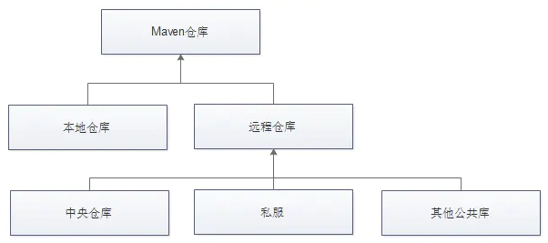
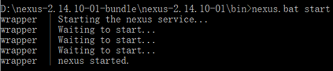
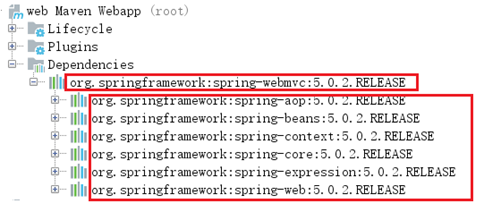
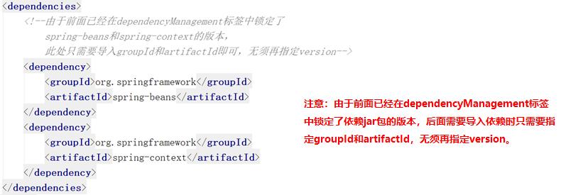

*date: 2020-11-18*

## Maven 的功能

Maven 是一个项目管理工具，主要作用是在项目开发阶段对项目进行`依赖管理`和`项目构建`。

- 依赖管理：仅仅通过 jar 包的几个属性，就能确定唯一的 jar 包，在指定的文件 pom.xml 中，只要写入这些依赖属性，就会自动下载并管理 jar 包。


- 项目构建：内置很多的插件与生命周期，支持多种任务，比如校验、编译、测试、打包、部署、发布...


- 项目的知识管理：管理项目相关的其他内容，比如开发者信息，版本等等。


## Maven 的安装与配置

第一步：下载，地址：http://maven.apache.org/download.cgi


>注意：安装 Maven 之前，必须先确保你的机器中已经安装了 JDK，如果是 Maven 3.3 则要求必须 JDK 7 以上。

第二步：解压，添加环境变量`MAVEN_HOME`，值为解压后的 Maven 路径。

.jpg)

第三步：在`Path`环境变量的变量值末尾添加`%MAVEN_HOME%\bin`。

.jpg)

第四步：在 cmd 窗口输入`mvn --version`，显示 Maven 版本信息，说明安装配置成功。

.jpg)

## 在 IDEA 中使用 Maven


## Maven 的仓库

Maven 仓库分为`本地仓库`和`远程仓库`，而远程仓库又分为`Maven 中央仓库`、`其他远程仓库`和`私服（私有服务器）`。其中，中央仓库是由 Maven 官方提供的，而私服就需要我们自己搭建。



### 本地仓库

默认情况下，不管 Linux 还是 Windows，每个用户在自己的用户目录下都有一个路径名为`.m2\repository`的仓库目录，如：C:\Users\XiSun\\.m2\repository。如果不自定义本地仓库的地址，则会将下载的构件放到该目录下。

修改 Maven 根目录下的 conf 文件夹中的`setting.xml`文件，可以自定义本地仓库地址，例如：

```xml
<localRepository>D:\Program Files\Maven\apache-maven-3.6.3-maven-repository</localRepository>
```

> 说明：运行 Maven 的时候，Maven 所需要的任何构件都是直接从本地仓库获取的。如果本地仓库没有，它会首先尝试从远程仓库下载构件至本地仓库，然后再使用本地仓库的构件。

### 远程仓库

#### Maven 中央仓库

Maven 中央仓库，是由 Maven 社区提供的仓库，其中包含了大量常用的库。一般来说，简单的  Java 项目依赖的构件都可以在这里下载到。

因为 Maven 中央仓库默认在国外，国内使用难免很慢，推荐将其更换为阿里云的镜像。

>在 Maven 安装目录的 lib 目录下，有一个 maven-model-builder-3.6.1.jar，里面的 org/apache/maven/model/pom-4.0.0.xml 文件定义了 Maven 默认中央仓库的地址：https://repo.maven.apache.org/maven2

`全局配置`：修改 Maven 根目录下的 conf 文件夹中的`setting.xml`文件，在`mirrors 节点`上，添加如下内容。

```xml
<mirrors>
    <!-- mirror
     | Specifies a repository mirror site to use instead of a given repository. The repository that
     | this mirror serves has an ID that matches the mirrorOf element of this mirror. IDs are used
     | for inheritance and direct lookup purposes, and must be unique across the set of mirrors.
     |
    <mirror>
      <id>mirrorId</id>
      <mirrorOf>repositoryId</mirrorOf>
      <name>Human Readable Name for this Mirror.</name>
      <url>http://my.repository.com/repo/path</url>
    </mirror>
     -->
    <mirror>
      <id>alimaven</id>
      <name>aliyun maven</name>
      <url>http://maven.aliyun.com/nexus/content/groups/public/</url>
      <mirrorOf>central</mirrorOf>
    </mirror>
</mirrors>
```

`局部配置`：修改项目的`pom.xml`文件，在`repositories 节点`上，添加如下内容。

```xml
<repositories>
    <repository>
    	<id>alimaven</id>  
    	<name>aliyun maven</name>
        <url>http://maven.aliyun.com/nexus/content/groups/public/</url>
        <releases>
            <enabled>true</enabled>
        </releases>
        <snapshots>
            <enabled>false</enabled>
        </snapshots>
    </repository>
</repositories>
```

> 更多中央仓库地址参考：https://blog.csdn.net/Hello_World_QWP/article/details/82463799。

#### 私服

Maven 私服就是公司局域网内的 Maven 远程仓库，每个员工的电脑上安装 Maven 软件并且连接 Maven 私服，程序员可以将自己开发的项目打成 jar 并发布到私服，其它项目组成员就可以从私服下载所依赖的 jar。

私服还充当一个代理服务器的角色，当私服上没有 jar 包时，会从 Maven 中央仓库自动下载。

`nexus`是一个 Maven 仓库管理器（其实就是一个软件），nexus 可以充当 Maven 私服，同时 nexus 还提供强大的仓库管理、构件搜索等功能。

如果 Maven 在中央仓库中也找不到依赖的文件，它会停止构建过程并输出错误信息到控制台。为避免这种情况，Maven 提供了远程仓库的概念，它是开发人员自己定制的仓库，包含了所需要的代码库或者其他工程中用到的 jar 文件。

##### Windows 搭建 Maven 私服

1. 下载 nexus，地址：https://help.sonatype.com/repomanager2/download/download-archives---repository-manager-oss

2. 安装 nexus

   - 将下载的压缩包进行解压，进入 bin 目录：

     

   - 打开 cmd 窗口并进入上面 bin 目录下，执行`nexus.bat install`命令安装服务（注意需要以管理员身份运行 cmd 命令）：

     

3. 启动 nexus

   - 经过前面命令已经完成 nexus 的安装，可以通过如下两种方式启动 nexus 服务。

     - 在 Windows 系统服务中启动 nexus：

       

     - 在命令行执行`nexus.bat start`命令启动 nexus：

       


4. 访问 nexus

   - 启动 nexus 服务后，访问`http://localhost:8081/nexus`，点击右上角 LogIn 按钮，使用默认用户名 admin 和密码 admin123 登录系统。

   - 登录成功后，点击左侧菜单 Repositories，可以看到 nexus 内置的仓库列表，如下图：

     

##### nexus 仓库类型

通过前面的仓库列表可以看到，nexus 默认内置了很多仓库，这些仓库可以划分为 4 种类型，每种类型的仓库用于存放特定的 jar 包，具体说明如下。

- `hosted`：宿主仓库，部署自己的 jar 到这个类型的仓库，包括 Releases 和 Snapshots 两部分，Releases 为公司内部发布版本仓库，Snapshots 为公司内部测试版本仓库。


- `proxy`：代理仓库，用于代理远程的公共仓库，如 Maven 中央仓库，用户连接私服，私服自动去中央仓库下载 jar 包或者插件。

- `group`：仓库组，用来合并多个 hosted 或 proxy 仓库，通常我们配置自己的 Maven 连接仓库组。

- `virtual`（虚拟）：兼容 Maven1 版本的 jar 或者插件。


##### nexus 仓库类型与安装目录对应关系


##### 将项目发布到 Maven 私服

Maven 私服是搭建在公司局域网内的 Maven 仓库，公司内的所有开发团队都可以使用。例如技术研发团队开发了一个基础组件，就可以将这个基础组件打成 jar 包发布到私服，其他团队成员就可以从私服下载这个 jar 包到本地仓库并在项目中使用。

具体操作步骤如下：

1. 配置 Maven 的 settings.xml 文件

   ```xml
   <server>
       <id>releases</id>
       <username>admin</username>   
       <password>admin123</password>
   </server>
   <server>
       <id>snapshots</id>
       <username>admin</username>
       <password>admin123</password>
   </server>
   ```

   >注意：一定要在 IDEA 工具中引入的 Maven 的 settings.xml 文件中配置。

2. 配置项目的 pom.xml 文件

   ```xml
   <distributionManagement>
       <repository>
          <id>releases</id>
          <url>http://localhost:8081/nexus/content/repositories/releases/</url>
       </repository>
   	<snapshotRepository>
      		<id>snapshots</id>
           <url>http://localhost:8081/nexus/content/repositories/snapshots/</url>
       </snapshotRepository>
   </distributionManagement>
   ```

3. 执行`mvn clean deploy`命令


##### 从私服下载 jar 到本地仓库

前面我们已经完成了将本地项目打成 jar 包发布到 Maven 私服，下面我们就需要从 Maven 私服下载 jar 包到本地仓库。

具体操作步骤如下：

1. 在 Maven 的 settings.xml 文件中配置下载模板

   ```xml
   <profile>
   	<id>dev</id>
   	<repositories>
   		<repository>
   			<id>nexus</id>
   			<!--仓库地址，即nexus仓库组的地址-->
   			<url>http://localhost:8081/nexus/content/groups/public/</url>
   			<!--是否下载releases构件-->
   			<releases>
   				<enabled>true</enabled>
   			</releases>
   			<!--是否下载snapshots构件-->
   			<snapshots>
   				<enabled>true</enabled>
   			</snapshots>
   		</repository>
   	</repositories>
   	<pluginRepositories>
   		<!-- 插件仓库，maven的运行依赖插件，也需要从私服下载插件 -->
           <pluginRepository>
               <id>public</id>
               <name>Public Repositories</name>
               <url>http://localhost:8081/nexus/content/groups/public/</url>
           </pluginRepository>
   	</pluginRepositories>
   </profile>
   ```

2. 在 Maven 的 settings.xml 文件中配置激活下载模板

   ```xml
   <activeProfiles>
   	<activeProfile>dev</activeProfile>
   </activeProfiles>
   ```

### 安装第三方 jar

在 Maven 工程的 pom.xml 文件中配置某个 jar 包的坐标后，如果本地的 Maven 仓库不存在这个 jar 包，Maven 工具会自动到配置的 Maven 私服下载，如果私服中也不存在，Maven 私服就会从 Maven 中央仓库进行下载。

但是并不是所有的 jar 包都可以从中央仓库下载到，比如常用的 Oracle 数据库驱动的 jar 包在中央仓库就不存在。此时需要到 Oracle 的官网下载驱动 jar 包，然后将此 jar 包通过 Maven 命令安装到我们本地的 Maven 仓库或者 Maven 私服中，这样在 Maven 项目中就可以使用 Maven 坐标引用到此 jar 包了。

#### 将第三方 jar 安装到本地仓库

1. 下载 Oracle 的 jar 包

2. 执行`mvn install`命令进行安装

      ```powershell
mvn install:install-file -Dfile=ojdbc14-10.2.0.4.0.jar -DgroupId=com.oracle -DartifactId=ojdbc14 –Dversion=10.2.0.4.0 -Dpackaging=jar
      ```

3. 查看本地 Maven 仓库，确认安装是否成功

      

再比如安装 Classifier4J-0.6.jar，打开 cmd 窗口，切换到 jar 包所在目录，输入 mvn 命令，命令格式如下：

```sh
mvn install:install-file -DgroupId=net.sf(自定义，需要与pom.xml文件中的groupId一致) -DartifactId=classifier4j(自定义，需要与pom.xml文件中的artifaceId一致) -Dversion=0.6(自定义，需要与pom.xml文件中的version一致) -Dpackaging=jar -Dfile=Classifier4J-0.6.jar(本地jar包路径)
```

> 注意：-DgroupId、-DartifactId、-Dversion、-Dpackaging、-Dfile 前面均有一个空格。

使用示例如下：


之后，在 Maven 的本地仓库，根据 groupId —— artifactId —— version，即可找到打包进来的本地 jar 包，也可以在项目中的 pom.xml 文件引入：

```xml
<dependency>
    <groupId>net.sf</groupId>
    <artifactId>classifier4j</artifactId>
    <version>0.6</version>
</dependency>
```

#### 将第三方 jar 安装到 Maven 私服

1. 下载 Oracle 的 jar 包

2. 在 Maven 的 settings.xml 配置文件中配置第三方仓库的 server 信息

   ```xml
   <server>
     <id>thirdparty</id>
     <username>admin</username>
     <password>admin123</password>
   </server>
   ```

3. 执行`mvn deploy`命令进行安装

      ```powershell
      mvn deploy:deploy-file -Dfile=ojdbc14-10.2.0.4.0.jar -DgroupId=com.oracle -DartifactId=ojdbc14 –Dversion=10.2.0.4.0 -Dpackaging=jar –Durl=http://localhost:8081/nexus/content/repositories/thirdparty/ -DrepositoryId=thirdparty
      ```

### Maven 常用网址

https://repo1.maven.org/maven2/

https://mvnrepository.com/

https://developer.aliyun.com/mvn/guide

## Maven 的依赖搜索顺序

一般情况下，当执行 Maven 构建命令时，Maven 按照以下顺序查找依赖的库：

- **步骤 1**：在本地仓库中搜索，如果找不到，执行步骤 2，如果找到了则执行其他操作。
- **步骤 2**：在中央仓库中搜索，如果找不到，并且有一个或多个远程仓库已经设置，则执行步骤 4，如果找到了则下载到本地仓库中以备将来引用。
- **步骤 3**：如果远程仓库没有被设置，Maven 将简单的停滞处理并抛出错误（无法找到依赖的文件）。
- **步骤 4**：在一个或多个远程仓库中搜索依赖的文件，如果找到则下载到本地仓库以备将来引用，否则 Maven 将停止处理并抛出错误（无法找到依赖的文件）。

## Maven 的常用命令

- `clean`：清理


- `compile`：编译


- `test`： 测试


- `package`：打包


- `install`：安装

## Maven 的坐标书写规范

```xml
<dependency>
    <groupId>org.projectlombok</groupId>
    <artifactId>lombok</artifactId>
    <version>1.18.10</version>
</dependency>
```

## Maven 的依赖范围

| 依赖范围 | 对于编译 classpath 有效 | 对于测试 classpath 有效 | 对于运行 classpath 有效 | 例子                         |
| -------- | ----------------------- | ----------------------- | ----------------------- | ---------------------------- |
| compile  | Y                       | Y                       | Y                       | spring-core                  |
| test     | -                       | Y                       | -                       | Junit                        |
| provided | Y                       | Y                       | -                       | servlet-api                  |
| runtime  | -                       | Y                       | Y                       | JDBC 驱动                    |
| system   | Y                       | Y                       | -                       | 本地的，Maven 仓库之外的类库 |

默认使用`compile`依赖范围。

使用 system 依赖范围的依赖时，必须通过 systemPath 元素显示地指定依赖文件的路径。由于此类依赖不是通过 Maven 仓库解析的，而且往往与本机系统绑定，可能构成构建的不可移植，因此应该谨慎使用。systemPath 元素可以引用环境变量，例如：

```xml
<dependency>
    <groupId>javax.sql</groupId>
    <artifactId>jdbc-stdext</artifactId>
    <Version>2.0</Version>
    <scope>system</scope>
    <systemPath>${java.home}/lib/rt.jar</systemPath>
</dependency>
```

## Maven 的依赖传递

### 什么是依赖传递

在 Maven 中，依赖是可以传递的，假设存在三个项目，分别是项目 A，项目 B 以及项目 C。假设 C 依赖 B，B 依赖 A，那么根据 Maven 项目依赖的特征，不难推出项目 C 也依赖 A。如图所示：


​                         

通过上面的图可以看到， 在一个 web 项目中，直接依赖了 spring-webmvc，而 spring-webmvc 依赖了 spring-aop、spring-beans 等。最终的结果就是在这个 web 项目中，间接依赖了 spring-aop、spring-beans 等。

### 什么是依赖冲突

由于依赖传递现象的存在，如图所示，spring-webmvc 依赖 spirng-beans-4.2.4，spring-aop 依赖 spring-beans-5.0.2，现在 spirng-beans-4.2.4 已经加入到了工程中，而我们希望 spring-beans-5.0.2 加入工程。这就造成了依赖冲突。


### 如何解决依赖冲突

1. 使用 Maven 提供的依赖调节原则 


2. 排除依赖

3. 锁定版本 

#### 依赖调节原则

##### 路径近者优先原则

当依赖声明不在同一个 pom.xml 文件中时，或者说存在依赖传递时，路径最短的 jar 包将被选为最终依赖。


上图中，Jar2.0 将被选为最终依赖。

##### 第一声明者优先原则

当依赖声明不在同一个 pom.xml 文件中时，或者说存在依赖传递时，并且依赖传递长度相同时，最先声明的依赖将被选为最终依赖。


上图中，spring-aop 和 spring-webmvc 都依赖了 spring-beans，但是因为 spring-aop 在前面，所以最终使用的 spring-beans 是由 spring-aop 传递过来的，而 spring-webmvc 传递过来的 spring-beans 则被忽略了。

##### 覆盖优先

当依赖声明在同一个 pom.xml 文件中时，后面声明的依赖将覆盖前面声明的依赖。

#### 排除依赖

使用 exclusions 标签将传递过来的依赖排除出去。


#### 版本锁定

采用直接锁定版本的方法确定依赖 jar 包的版本，版本锁定后则不考虑依赖的声明顺序或依赖的路径，以锁定的版本为准添加到工程中，此方法在企业开发中经常使用。

版本锁定的使用方式：

第一步：在 dependencyManagement 标签中锁定依赖的版本


第二步：在 dependencies 标签中声明需要导入的 maven 坐标



## 本文参考

https://juejin.cn/post/6844903543711907848

https://www.jianshu.com/p/a1d9fd97f568

## 声明

写作本文初衷是个人学习记录，鉴于本人学识有限，如有侵权或不当之处，请联系 [wdshfut@163.com](mailto:wdshfut@163.com)。