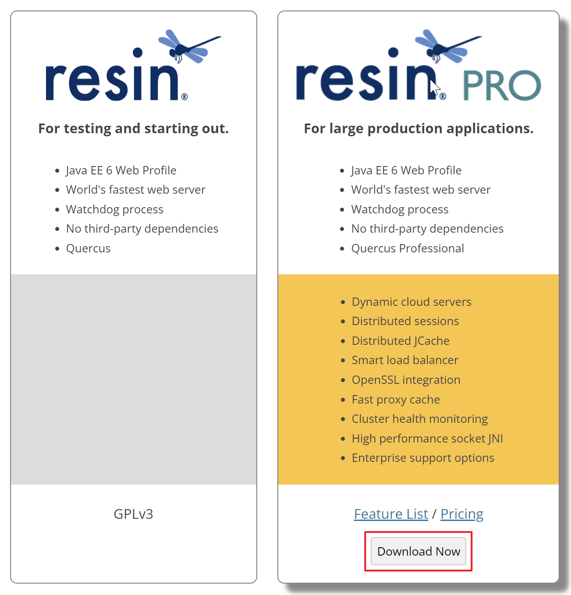
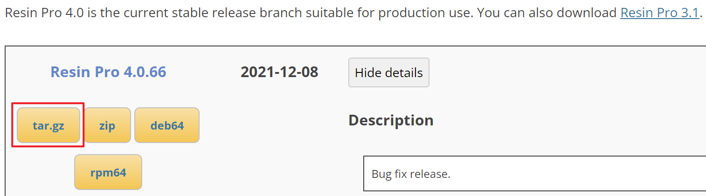
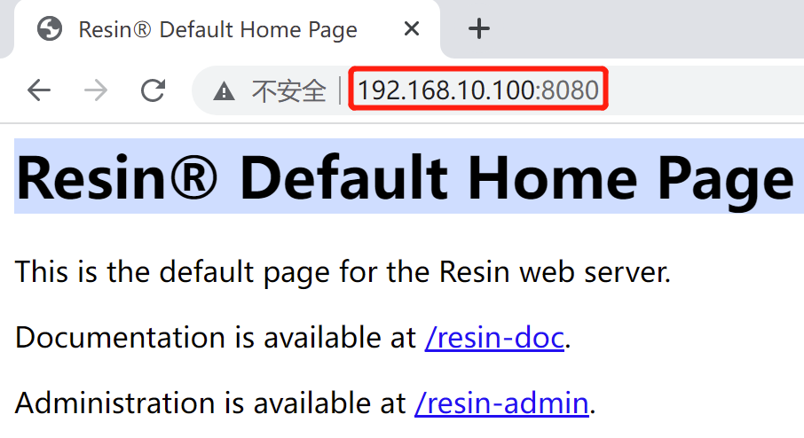

*date: 2022-07-27*

## 简介

官网：https://caucho.com/

Resin 是 CAUCHO 公司的产品，是一个非常流行的支持 servlets 和 jsp 的引擎。

Resin 本身包含了一个支持 HTTP/1.1 的 WEB 服务器。虽然它可以显示动态内容，但是它显示静态内容的能力也非常强，速度直逼 Apache Server。许多站点都是使用该 WEB 服务器构建的。

Resin 也可以和许多其他的 WEB 服务器一起工作，比如 Apache Server 和 IIS 等。Resin 支持 Servlets 2.3 标准和 JSP 1.2 标准。熟悉 ASP 和 PHP 的用户可以发现用 Resin 来进行 JSP 编程是件很容易的事情。

Resin 支持负载平衡（Load balancing），可以增加 WEB 站点的可靠性。方法是增加服务器的数量。比如一台 SERVER 的错误率是 1% 的话，那么支持负载平衡的两个 Resin 服务器就可以使错误率降到 0.01%。

Resin 分普通版本和 Pro 版本，主要区别是 Pro 版本支持缓存和负载均衡。Pro 版本因为有强大的 cache 功能，独立作为 Web 服务器以及处理静态页面的性能，都可以和 Apache 有一比。但普通版本独立作为 Web 服务器性能就要差一些，当然可以使用 Apache + Resin 的方案借助 Apache 的缓存功能提高性能，但负载均衡就是普通版不能比的了。

## 下载

地址：https://caucho.com/products/resin/download





下载 tar.gz，并上传到 Linux 虚拟机上。

## 安装

安装过程：

```bash
root@xisun-develop:/opt# tar -zxvf resin-pro-4.0.66.tar.gz
root@xisun-develop:/opt# cd resin-pro-4.0.66
root@xisun-develop:/opt/resin-pro-4.0.66# echo $JAVA_HOME
/usr/lib/jvm/java-1.8.0-openjdk-amd64
root@xisun-develop:/opt/resin-pro-4.0.66# ./configure --prefix=/usr/local/resin --with-java-home=/usr/lib/jvm/java-1.8.0-openjdk-amd64 --enable-64bit
root@xisun-develop:/opt/resin-pro-4.0.66# make && make install
```

安装成功后，会显示配置日志：

```bash
Resin Configuration Summary:
 
  RESIN       : 4.0.66
    home      : /usr/local/resin
    root      : /usr/local/resin
    conf      : /usr/local/resin/conf
    log       : /usr/local/resin/log
    plugins   : common resin_os resin 
    init      : /etc/init.d/resin
 
  JAVA_HOME   : /usr/lib/jvm/java-1.8.0-openjdk-amd64
 
  JNI         : 64-bit
    include       : -I/usr/lib/jvm/java-1.8.0-openjdk-amd64/include -I/usr/lib/jvm/java-1.8.0-openjdk-amd64/include/linux
    CFLAGS        : 
    cflags_shlib  : -fpic
    ld_shlib      : gcc
    ldflags_shlib : -shared -fPIC -m64
    libs_shlib    : 
    epoll() for keepalives
 
  OPENSSL     : No OpenSSL has been found
    *** OpenSSL libraries cannot be compiled ***
```

## 服务命令

启动服务：

```bash
root@xisun-develop:/usr/local/resin/bin# /usr/local/resin/bin/resin.sh start
```

验证服务：

```bash
root@xisun-develop:/usr/local/resin/bin# netstat -tnlp |grep java
tcp        0      0 127.0.0.1:6800          0.0.0.0:*               LISTEN      14221/java          
tcp        0      0 127.0.0.1:6600          0.0.0.0:*               LISTEN      14170/java          
tcp6       0      0 :::8080                 :::*                    LISTEN      14221/java 
```

访问：



> 关于管理页面的操作，本文不涉及。

关闭服务：

```bash
root@xisun-develop:/usr/local/resin/bin# /usr/local/resin/bin/resin.sh stop
```

## 部署服务

拷贝自已的项目到 Resin 的 webapps 目录下，如果是 war 包，则直接上传到 webapps 目录，然后重启 Resin，就会自动创建目录并解压。

例如，上传 pro20210406.rar 到`/usr/local/resin/webapps`目录，然后解压，重启服务

```bash
root@xisun-develop:/usr/local/resin/webapps# pwd
/usr/local/resin/webapps
root@xisun-develop:/usr/local/resin/webapps# unrar x pro20210406.rar
root@xisun-develop:/usr/local/resin/webapps# ls
pro20210406  pro20210406.rar  ROOT
```

## 低版本安装部署

修改安装包 conf 目录下`resin.conf`文件，指定需要部署的服务，以及数据库连接信息：

```conf
<web-app id="/" root-directory="D:\Programs\Resin\pro">
    <database>
        <jndi-name>jdbc/hd</jndi-name>
        <driver type="oracle.jdbc.driver.OracleDriver">
            <url>jdbc:oracle:thin:@localhost:1521:orcl</url>
            <user>aaa</user>
            <password>123456</password>
        </driver>
        <prepared-statement-cache-size>8</prepared-statement-cache-size>
        <max-connections>150</max-connections>
        <max-idle-time>30s</max-idle-time>
    </database>
</web-app>
```

> 本地部署 resin 服务，通过 httpd.exe 程序启动时，需要先安装 JDK。

## 本文参考

http://auan.cn/server/1274.html

## 声明

写作本文初衷是个人学习记录，鉴于本人学识有限，如有侵权或不当之处，请联系 [wdshfut@163.com](mailto:wdshfut@163.com)。
