*date: 2023-06-15*

## 概述

官网：https://cn.vuejs.org/

简介：

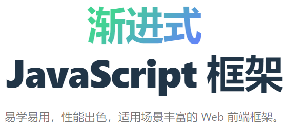

作者：尤雨溪。


历史进展：

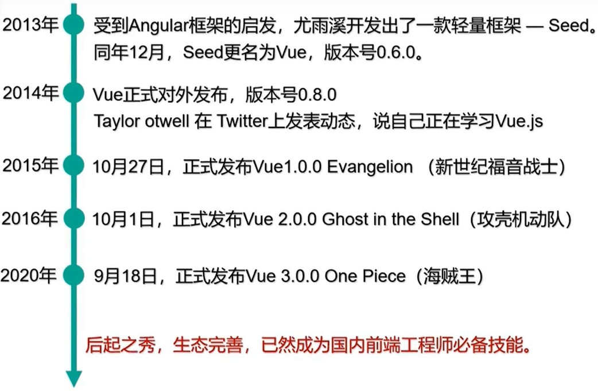

特点：

- 采用`组件化模式`，提高代码复用率，让代码更好维护。
- `声明式编码`，让编码人员无需直接操作 DOM，提高开发效率。
- 使用`虚拟 DOM + 优秀的 Diff 算法`，尽量复用 DOM 节点。

> 后续 Vue 学习，先从 Vue 2 开始。

## 搭建框架

官网：https://v2.cn.vuejs.org/

**安装 Vue Devtools：**

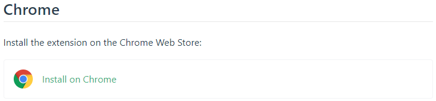

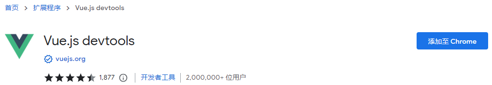

> Github：https://github.com/vuejs/devtools#vue-devtools

安装 Vue Devtools 后，需要开启：

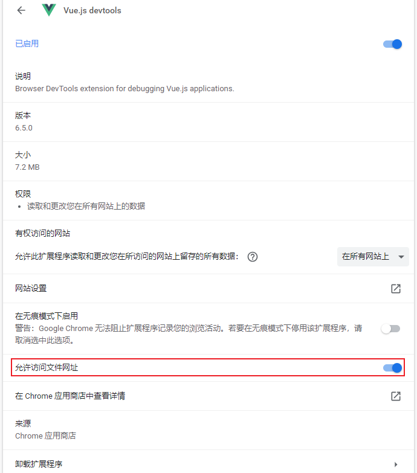

使用 Vue 开发的页面，Vue Devtools 图标显示正常使用：

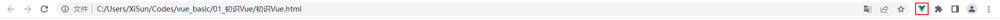

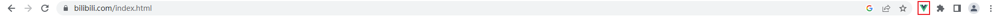

>vue.mini.js 默认关闭调试，不能用插件进行调试。

**下载 js 文件：**

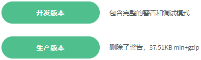

> 在熟悉 Vue 之前，使用`<script>`标签引入 vue.js，此时，Vue 会被注册为一个全局变量。。
>
> 使用 Vs Code 编辑 html 页面时，可以安装插件 `open in browser`，然后在 html 编辑页面，鼠标右键可以直接使用浏览器打开，查看效果。

**阻止 Vue 在启动时生成生产提示：**

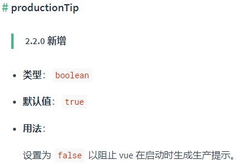

## Vue 核心

### 初识 Vue

```html
<!DOCTYPE html>
<html lang="en">

<head>
    <meta charset="UTF-8">
    <meta name="viewport" content="width=device-width, initial-scale=1.0">
    <title>初识Vue</title>
    <!-- 引入Vue -->
    <script type="text/javascript" src="../js/vue.js"></script>
</head>

<body>
    <!-- 
			初识Vue: 
				1.想让Vue工作, 就必须创建一个Vue实例, 且要传入一个配置对象
				2.root容器里的代码依然符合html规范, 只不过混入了一些特殊的Vue语法
				3.root容器里的代码被称为[Vue模板]
				4.Vue实例和容器是一一对应的
				5.真实开发中只有一个Vue实例, 并且会配合着组件一起使用
				6.{{xxx}}中的xxx要写js表达式, 且xxx可以自动读取到data中的所有属性
				7.一旦data中的数据发生改变, 那么页面中用到该数据的地方也会自动更新

				注意区分: js表达式和js代码(语句)
						1.表达式: 一个表达式会产生一个值, 可以放在任何一个需要值的地方: 
									(1). a
									(2). a+b
									(3). demo(1)
									(4). x === y ? 'a' : 'b'

						2.js代码(语句)
									(1). if(){}
									(2). for(){}
	-->

    <!-- 准备好一个容器 -->
    <div id="root">
        <h1>Hello, {{name.toUpperCase()}}, {{address}}</h1>
    </div>

    <script type="text/javascript">
        Vue.config.productionTip = false //阻止Vue在启动时生成生产提示

        // 创建Vue实例
        new Vue({
            // el: document.getElementById("demo"), // 原始写法
            el: '#root', // el用于指定当前Vue实例为哪个容器服务, 值通常为css选择器字符串
            data: { // data中用于存储数据, 数据供el所指定的容器去使用, 值我们暂时先写成一个对象
                name: '尚硅谷',
                address: '北京'
            }
        })

    </script>
</body>

</html>
```

> VSCode 可以使用 ! 快速创建模板：
>
> ```html
> <!DOCTYPE html>
> <html lang="en">
> <head>
>     <meta charset="UTF-8">
>     <meta name="viewport" content="width=device-width, initial-scale=1.0">
>     <title>Document</title>
> </head>
> <body>
>     
> </body>
> </html>
> ```

### 模板语法

```html
<!DOCTYPE html>
<html lang="en">

<head>
    <meta charset="UTF-8">
    <meta name="viewport" content="width=device-width, initial-scale=1.0">
    <title>模板语法</title>
    <!-- 引入Vue -->
    <script type="text/javascript" src="../js/vue.js"></script>
</head>

<body>
    <!-- 
            Vue模板语法有2大类: 
                1.插值语法: 
                        功能: 用于解析标签体内容
                        写法: {{xxx}}, xxx是js表达式, 且可以直接读取到data中的所有属性
                2.指令语法: 
                        功能: 用于解析标签(包括: 标签属性、标签体内容、绑定事件.....)
                        举例: v-bind:href="xxx"或简写为:href="xxx", xxx同样要写js表达式, 且可以直接读取到data中的所有属性   
                        备注: Vue中有很多的指令, 且形式都是: v-????, 此处我们只是拿v-bind举个例子, 不同的指令简写不同

     -->
    
    <!-- 准备好一个容器-->
    <div id="root">
        <h1>插值语法</h1>
        <h3>你好, {{name}}</h3>
        <hr />
        <h1>指令语法</h1>
        <a v-bind:href="school.url.toUpperCase()" x="hello">点我去{{school.name}}学习1</a>
        <a :href="school.url" x="hello">点我去{{school.name}}学习2</a>
    </div>
</body>

<script type="text/javascript">
    Vue.config.productionTip = false // 阻止Vue在启动时生成生产提示

    new Vue({
        el: '#root',
        data: {
            name: 'jack',
            school: {
                name: '尚硅谷',
                url: 'http://www.atguigu.com',
            }
        }
    })
</script>

</html>
```

### 数据绑定

```html
<!DOCTYPE html>
<html lang="en">

<head>
    <meta charset="UTF-8">
    <meta name="viewport" content="width=device-width, initial-scale=1.0">
    <title>数据绑定</title>
    <!-- 引入Vue -->
    <script type="text/javascript" src="../js/vue.js"></script>
</head>

<body>
    <!-- 
        Vue中有2种数据绑定的方式: 
                1.单向绑定(v-bind): 数据只能从data流向页面
                2.双向绑定(v-model): 数据不仅能从data流向页面, 还可以从页面流向data
                    备注: 
                            1.双向绑定一般都应用在表单类元素上(如: input、select等)
                            2.v-model:value可以简写为v-model, 因为v-model默认收集的就是value值
     -->
    <!-- 准备好一个容器-->
    
    <div id="root">
        <!-- 普通写法 -->
        <!-- 
            单向数据绑定: <input type="text" v-bind:value="name"><br/>
            双向数据绑定: <input type="text" v-model:value="name"><br/> 
        -->

        <!-- 简写 -->
        单向数据绑定: <input type="text" :value="name"><br />
        双向数据绑定: <input type="text" v-model="name"><br />

        <!-- 如下代码是错误的, 因为v-model只能应用在表单类元素(输入类元素)上 -->
        <!-- <h2 v-model:x="name">你好啊</h2> -->
    </div>
</body>

<script type="text/javascript">
    Vue.config.productionTip = false // 阻止Vue在启动时生成生产提示

    new Vue({
        el: '#root',
        data: {
            name: '尚硅谷'
        }
    })
</script>

</html>
```

### el 与 data 的两种写法

```html
<!DOCTYPE html>
<html lang="en">

<head>
    <meta charset="UTF-8">
    <meta name="viewport" content="width=device-width, initial-scale=1.0">
    <title>el与data的两种写法</title>
    <!-- 引入Vue -->
    <script type="text/javascript" src="../js/vue.js"></script>
</head>

<body>
    <!-- 
        data与el的2种写法
                1.el有2种写法
                                (1).new Vue时候配置el属性
                                (2).先创建Vue实例, 随后再通过vm.$mount('#root')指定el的值
                2.data有2种写法
                                (1).对象式
                                (2).函数式
                                如何选择: 目前哪种写法都可以, 以后学习到组件时, data必须使用函数式, 否则会报错
                3.一个重要的原则: 
                                由Vue管理的函数, 一定不要写箭头函数, 一旦写了箭头函数, this就不再是Vue实例了
    -->

    <!-- 准备好一个容器-->
    <div id="root">
        <h1>你好, {{name}}</h1>
    </div>
</body>

<script type="text/javascript">
    Vue.config.productionTip = false // 阻止vue在启动时生成生产提示

    // el的两种写法
    /* const v = new Vue({
        // el:'#root', // 第一种写法
        data:{
            name:'尚硅谷'
        }
    })
    console.log(v)
    v.$mount('#root') // 第二种写法 */

    // data的两种写法
    new Vue({
        el: '#root',
        // data的第一种写法: 对象式
        /* data:{
            name:'尚硅谷'
        } */

        // data的第二种写法: 函数式
        data() {
            console.log('@@@', this) // 此处的this是Vue实例对象
            return {
                name: '尚硅谷'
            }
        }
    })
</script>

</html>
```

### MVVM 模型

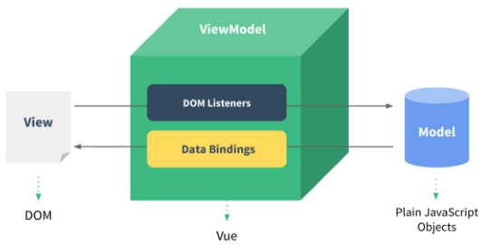

```html
<!DOCTYPE html>
<html lang="en">

<head>
    <meta charset="UTF-8">
    <meta name="viewport" content="width=device-width, initial-scale=1.0">
    <title>MVVM模型</title>
    <!-- 引入Vue -->
    <script type="text/javascript" src="../js/vue.js"></script>
</head>

<body>
    <!-- 
        MVVM模型: 
                    1.M: 模型(Model): data中的数据
                    2.V: 视图(View): 模板代码
                    3.VM: 视图模型(ViewModel): Vue实例
        观察发现: 
                    1.data中所有的属性, 最后都出现在了vm身上
                    2.vm身上所有的属性及Vue原型上所有属性, 在Vue模板中都可以直接使用
    -->

    <!-- 准备好一个容器-->
    <div id="root">
        <h1>学校名称: {{name}}</h1>
        <h1>学校地址: {{address}}</h1>
        <!-- <h1>测试一下1: {{1+1}}</h1>
        <h1>测试一下2: {{$options}}</h1>
        <h1>测试一下3: {{$emit}}</h1>
        <h1>测试一下4: {{_c}}</h1> -->
    </div>
</body>

<script type="text/javascript">
    Vue.config.productionTip = false // 阻止Vue在启动时生成生产提示

    const vm = new Vue({
        el: '#root',
        data: {
            name: '尚硅谷',
            address: '北京',
        }
    })
    console.log(vm)
</script>

</html>
```

Vue 属性：

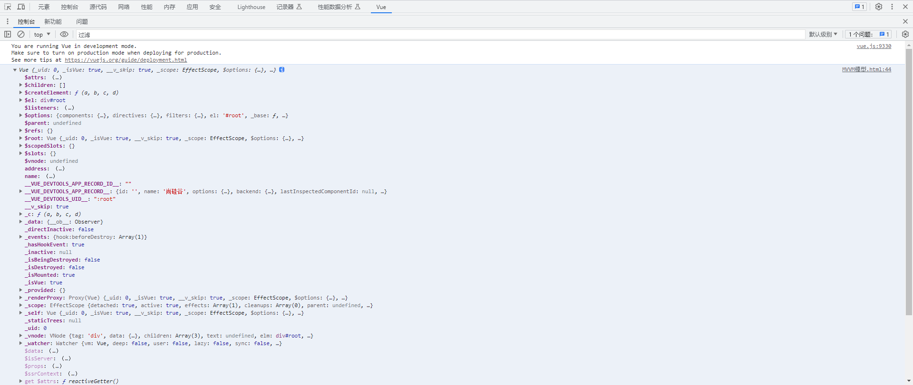

### 数据代理

#### 回顾 Object.defineProperty 方法

```html
<!DOCTYPE html>
<html lang="en">

<head>
    <meta charset="UTF-8">
    <meta name="viewport" content="width=device-width, initial-scale=1.0">
    <title>回顾Object.defineproperty方法</title>
</head>

<body>
    <script type="text/javascript">
        let number = 18
        let person = {
            name: '张三',
            sex: '男',
        }

        Object.defineProperty(person, 'age', {
            // value: 18,
            // enumerable: true, // 控制属性是否可以枚举, 默认值是false
            // writable: true, // 控制属性是否可以被修改, 默认值是false
            // configurable: true // 控制属性是否可以被删除, 默认值是false

            // 当有人读取person的age属性时, get函数(getter)就会被调用, 且返回值就是age的值
            get() {
                console.log('有人读取age属性了')
                return number
            },

            // 当有人修改person的age属性时, set函数(setter)就会被调用, 且会收到修改的具体值
            set(value) {
                console.log('有人修改了age属性, 且值是', value)
                number = value
            }

        })

        // console.log(Object.keys(person))

        console.log(person)
    </script>
</body>

</html>
```

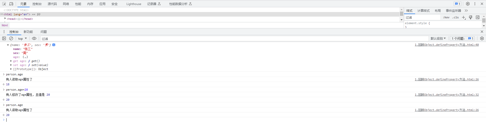

#### 数据代理

```html
<!DOCTYPE html>
<html lang="en">

<head>
    <meta charset="UTF-8">
    <meta name="viewport" content="width=device-width, initial-scale=1.0">
    <title>何为数据代理</title>
</head>

<body>
    <!-- 数据代理: 通过一个对象代理对另一个对象中属性的操作(读/写) -->
    <script type="text/javascript">
        let obj = { x: 100 }
        let obj2 = { y: 200 }

        Object.defineProperty(obj2, 'x', {
            get() {
                return obj.x
            },
            set(value) {
                obj.x = value
            }
        })
    </script>
</body>

</html>
```

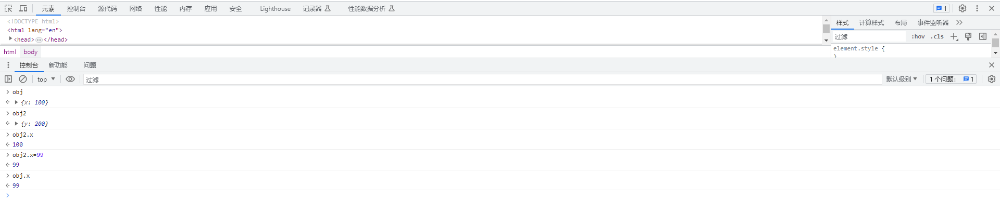

#### Vue 中的数据代理

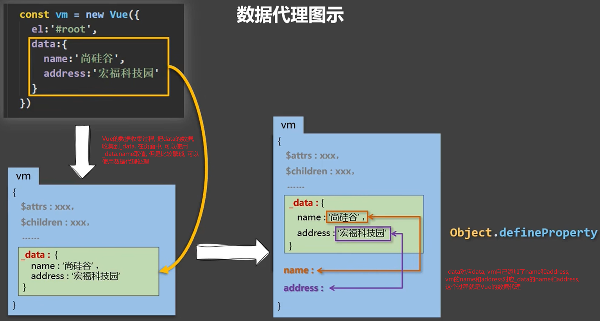

```html
<!DOCTYPE html>
<html lang="en">

<head>
    <meta charset="UTF-8">
    <meta name="viewport" content="width=device-width, initial-scale=1.0">
    <title>Vue中的数据代理</title>
    <!-- 引入Vue -->
    <script type="text/javascript" src="../js/vue.js"></script>
</head>

<body>
    <!-- 
            1.Vue中的数据代理: 
                        通过vm对象来代理data对象中属性的操作(读/写)
            2.Vue中数据代理的好处: 
                        更加方便的操作data中的数据
            3.基本原理: 
                        通过Object.defineProperty()把data对象中所有属性添加到vm上;
                        为每一个添加到vm上的属性, 都指定一个getter/setter;
                        在getter/setter内部去操作(读/写)data中对应的属性
     -->
    
    <!-- 准备好一个容器-->
    <div id="root">
        <h2>学校名称: {{name}}</h2>
        <h2>学校地址: {{address}}</h2>
    </div>
</body>

<script type="text/javascript">
    Vue.config.productionTip = false // 阻止Vue在启动时生成生产提示

    const vm = new Vue({
        el: '#root',
        data: {
            name: '尚硅谷',
            address: '宏福科技园'
        }
    })
</script>

</html>
```

> Vue 把 data 转换为 _data 的时候，做了一些其他处理，此处不表。

### 事件处理

#### 事件的基本使用

```html
<!DOCTYPE html>
<html lang="en">

<head>
    <meta charset="UTF-8">
    <meta name="viewport" content="width=device-width, initial-scale=1.0">
    <title>事件的基本使用</title>
    <!-- 引入Vue -->
    <script type="text/javascript" src="../js/vue.js"></script>
</head>

<body>
    <!-- 
            事件的基本使用：
                        1.使用v-on:xxx或@xxx绑定事件, 其中xxx是事件名;
                        2.事件的回调需要配置在methods对象中, 最终会在vm上;
                        3.methods中配置的函数, 不要用箭头函数！否则this就不是vm了;
                        4.methods中配置的函数, 都是被Vue所管理的函数, this的指向是vm或组件实例对象;
                        5.@click="demo"和@click="demo($event)"效果一致, 但后者可以传其他参数
    -->

    <!-- 准备好一个容器 -->
    <div id="root">
        <h2>欢迎来到{{name}}学习</h2>
        <!-- <button v-on:click="showInfo">点我提示信息</button> -->
        <!-- 回调函数名后的括号可以不加, 如果需要传参, 应使用$event占位表示event参数, 位置可以自定义, 建议放在第一个参数 -->
        <button @click="showInfo1">点我提示信息1（不传参）</button>
        <button @click="showInfo2($event,66)">点我提示信息2（传参）</button>
    </div>
</body>

<script type="text/javascript">
    Vue.config.productionTip = false // 阻止Vue在启动时生成生产提示

    const vm = new Vue({
        el: '#root',
        data: {
            name: '尚硅谷',
        },
        // 事件的回调方法不能定义在methods外面, 会报错
        /* showInfo(event) {
            alert('同学你好！')
        }, */
        methods: {
            showInfo1(event) {
                // console.log(event.target.innerText)
                // console.log(this) // 此处的this是vm
                alert('同学你好！')
            },
            showInfo2(event, number) {
                console.log(event, number)
                // console.log(event.target.innerText)
                // console.log(this) // 此处的this是vm, 如果定义的是箭头函数, 这个this是windows, 不是vm
                alert('同学你好！！参数：' + number)
            }
        }
    })
</script>

</html>
```

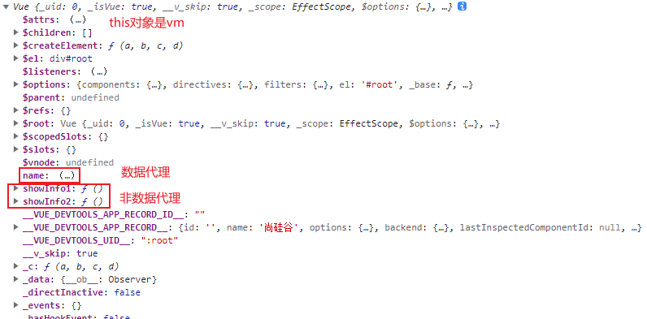

#### 事件修饰符

```html
<!DOCTYPE html>
<html lang="en">

<head>
    <meta charset="UTF-8">
    <meta name="viewport" content="width=device-width, initial-scale=1.0">
    <title>事件修饰符</title>
    <!-- 引入Vue -->
    <script type="text/javascript" src="../js/vue.js"></script>
    <style>
        * {
            margin-top: 20px;
        }

        .demo1 {
            height: 50px;
            background-color: skyblue;
        }

        .box1 {
            padding: 5px;
            background-color: skyblue;
        }

        .box2 {
            padding: 5px;
            background-color: orange;
        }

        .list {
            width: 200px;
            height: 200px;
            background-color: peru;
            overflow: auto;
        }

        li {
            height: 100px;
        }
    </style>
</head>

<body>
    <!-- 
            Vue中的事件修饰符: 
                    1.prevent: 阻止默认事件(常用);
                    2.stop: 阻止事件冒泡(常用);
                    3.once: 事件只触发一次(常用);
                    4.capture: 使用事件的捕获模式;
                    5.self: 只有event.target是当前操作的元素时才触发事件;
                    6.passive: 事件的默认行为立即执行, 无需等待事件回调执行完毕;
    -->

    <!-- 准备好一个容器 -->
    <div id="root">
        <h2>欢迎来到{{name}}学习</h2>
        <!-- 阻止默认事件(常用) -->
        <a href="http://www.atguigu.com" @click.prevent="showInfo">点我提示信息</a>

        <!-- 阻止事件冒泡(常用) -->
        <div class="demo1" @click="showInfo">
            <button @click.stop="showInfo">点我提示信息</button>
            <!-- 修饰符可以连续写 -->
            <!-- <a href="http://www.atguigu.com" @click.prevent.stop="showInfo">点我提示信息</a> -->
        </div>

        <!-- 事件只触发一次(常用), 只在第一次有效, 后续无效 -->
        <button @click.once="showInfo">点我提示信息</button>

        <!-- 使用事件的捕获模式 -->
        <!-- 先捕获, 再冒泡, 使用@click.capture, div1在捕获时就触发 -->
        <div class="box1" @click.capture="showMsg(1)">
            div1
            <div class="box2" @click="showMsg(2)">
                div2
            </div>
        </div>

        <!-- 只有event.target是当前操作的元素时才触发事件; -->
        <div class="demo1" @click.self="showInfo">
            <button @click="showInfo">点我提示信息</button>
        </div>

        <!-- 事件的默认行为立即执行, 无需等待事件回调执行完毕;(如果不加passive, 会等待事件回调执行完后, 再触发事件的默认行为) -->
        <ul @wheel.passive="demo" class="list">
            <li>1</li>
            <li>2</li>
            <li>3</li>
            <li>4</li>
        </ul>

    </div>
</body>

<script type="text/javascript">
    Vue.config.productionTip = false // 阻止Vue在启动时生成生产提示

    new Vue({
        el: '#root',
        data: {
            name: '尚硅谷'
        },
        methods: {
            showInfo(e) {
                // 常规的阻止默认事件的方法, Vue中使用@click.prevent代替
                // e.preventDefault()
                // 常规的阻止事件冒泡的方法, Vue中使用@click.stop代替
                // e.stopPropagation()
                alert('同学你好！')
                // console.log(e.target)
            },
            showMsg(msg) {
                console.log(msg)
            },
            demo() {
                for (let i = 0; i < 100000; i++) {
                    console.log('#')
                }
                console.log('累坏了')
            }
        }
    })
</script>

</html>
```

#### 键盘事件